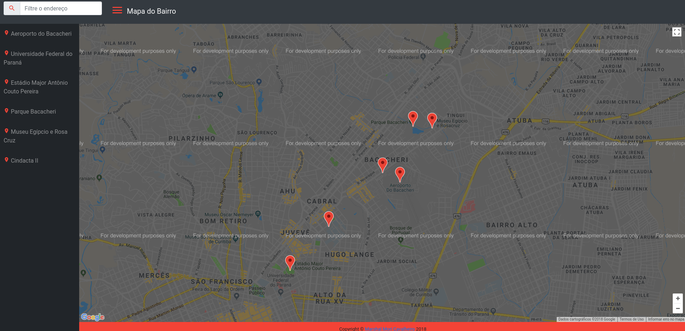

# Mapa do Bairro
O Mapa do Bairro é um projeto que apresenta alguns locais do bairro Bacacheri e seus vizinhos trazendo um marcador no mapa do Google e algumas informações sobre esses locais.
Aplicação feita em JavaScript, utilizando o framework knockout e API de mapas do Google. O promaga aprensentará uma sidebar com a lista dos locais, marcadores desses locais no mapa e em cada marcador teremos uma janela das informações do local. Além disso, um campo de pesquisa posicionado na navbar. Nesse campo de busca ao escrever o local ele vai retirando os locais não digitados da lista e o mesmo acontecerá com os marcadores no mapa.

## Instalação
A instalação dessa aplicação é bem simples:  basta clonar ou baixar este projeto.

## Como utilizar a aplicação
Acesse a pasta do projeto e abra em um navegador web o arquivo `index.html`. O arquivo com o JavaScript do projeto fica no seguinte caminho `/static/js/map.js`

### Tela inicial
Abaixo é apresentada a tela principal(e única) do projeto.

## APIs utilizadas
Foi utilizado duas APIs neste trabalho:
 * API do Google Maps - [link da documentação](https://developers.google.com/maps/documentation/)
 * API da Wikipédia - [link da documentação](https://www.mediawiki.org/wiki/API:Main_page/pt-br)

## Licença
O projeto Mapa do Bairro foi lançado com a licença [MIT
license](https://github.com/atom-community/markdown-preview-plus/blob/master/LICENSE.md).
